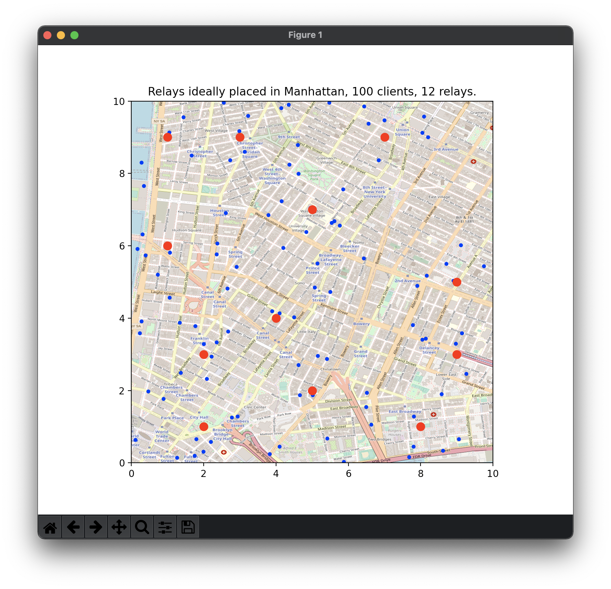

# Optimization of the positioning of relay points on Manhattan using a linear program
This program is an algorithm using linear programming to solve an optimization problem which is to minimize the Manhattan distance of given points.
A clustering method is used to divide the population in several sub-groups on which apply the Simplex algorithm.

## Usage

```python
from manhattan import solve

M = [(10, 20), (15, 45), (22, 19), (33, 42)]
p = 2
sol = solve(M, p)

# sol = [(14.0, 19.0), (21.0, 43.0)]
```
This sample code will basically return the 2 optimized positions for the given set of coordinates M.

## Visualization examples
<p align="center">
  
  
</p>

## Files

-   linear-programming-manhattan:
    -   AUTHORS
    -   README
    -   manhattan.py:           the library, only import solve()
    -   manhattan_poc.py:       proof of concept using some 2D plot visulization
    -   unit_tests.py:          unit tests
    -   manhattan_city_demo.py: perform the algorithm on Manhattan map
    -   SYNTHESE_A.pdf:         a brief thesis about the algorithm implementation
